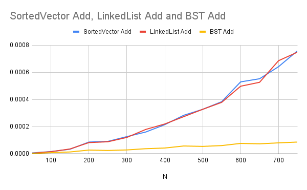
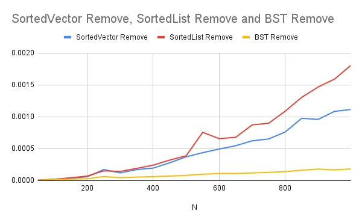

# Report for Data Structure Speed Comparison Homework

Make sure to answer every question in this homework. You should not bullet point your answers, but
instead write them as a full report format. This doesn't mean you have to be wordy, as concise is good,
but it does mean you need to use proper grammar, spelling, and be complete. For question that just
ask for a short answer, answer accordingly. Make sure to include references where appropriate.

## Algorithmic Analysis - Big $O$

Complete the Big O table below for the following functions. You may use any resource you like, but
for the SortedVector and SortedList, you should use the Big O for the functions you wrote in the
the homework. Both Single and Double Linked List you can assume head and tail pointers are available. 
Don't forget to use latex math notation (example in the table).

### Big $O$ Table

|                             | Add/Insert           | Remove             | Search/Find         | Sort           | Add Front | Add Back | Remove Front | Remove Back | Get by Index |
|-----------------------------|:--------------------:|:------------------:|:-------------------:|:--------------:|:---------:|:--------:|:------------:|:-----------:|:------------:|
| Vector                      | $O(n)$              | $O(n)$              | $O(n)$              | $O(n\log n)$   | $O(n)$    | $O(1)$    | $O(n)$        | $O(1)$    | $O(1)$       |
| Single Linked List          | $O(n)$              | $O(n)$              | $O(n)$              | $O(n\log n)$   | $O(1)$    | $O(n)$    | $O(1)$        | $O(n)$    | $O(n)$       |
| Double Linked List          | $O(n)$              | $O(n)$              | $O(n)$              | $O(n\log n)$   | $O(1)$    | $O(1)$    | $O(1)$        | $O(1)$    | $O(n)$       |
| Sorted Vector               | $O(n)$              | $O(n)$              | $O(\log n)$         | $O(1)$         |           |           |               |           |              |
| Sorted Single Linked List   | $O(n)$              | $O(n)$              | $O(n)$              | $O(1)$         |           |           |               |           |              |
| Sorted Double Linked List   | $O(n)$              | $O(n)$              | $O(n)$              | $O(1)$         |           |           |               |           |              |
| Binary Search Tree          | $O(\log n)$ (avg)   | $O(\log n)$ (avg)   | $O(\log n)$ (avg)   | $O(n)$         |           |           |               |           |              |

For Sort, we are asking for the Big $O$ for taking the current data structure and writing it 'sorted' to a file. However, not the file writes. For example, if you have a vector of 1000 elements, and you want to write it to a file, you would need to sort it first. So, the Big $O$ for this would be the Big $O$ for sorting. For BST, you have to convert the tree to a sequential structure, so the cost of doing that.  

### Assumptions with Sort

Since the worst case can change considerably based on what sort you use for sorting (if any), list each algorithm below, and specify the algorithm used in your assumption.  For BST, write which  method of traversal you would use to sort it.  

* Vector

- For the vector,  it uses something like Quick Sort or Merge Sort to sort the movies. Both usually run in $O(n \log n)$ time. Quick Sort can be slower in the worst case, but most libraries use a faster built-in version that handles that, so I’d say the average case is about $O(n \log n)$.

* Single Linked List

- For the single linked list, I’m assuming it would use something like Merge Sort since you can’t really do Quick Sort easily without random access. Merge Sort works better with linked lists because it can split and merge using pointers. The time complexity is about $O(n \log n)$ for both average and worst cases.

* Double Linked List

- I’m also assuming Merge Sort because it works well when you can move in both directions. It’s basically the same as the single linked list in terms of sorting performance. The time complexity is still around $O(n \log n)$ since you’re comparing and merging nodes just like before.

* Sorted Vector - already sorted
* Sorted Single Linked List - already sorted
* Sorted Double Linked List - already sorted

- There’s no need to run a separate sorting algorithm since thy're already sorted.The time complexity for sorting is basically $O(1)$

* Binary Search Tree 

-I’d use an in-order traversal to get the data in sorted order. That means visiting the left child, then the root, then the right child for every node. The time complexity for this is $O(n)$ because each node has to be visited once to create the full sorted list.

### Worst Case vs. Average Case

There are a few functions whose worse case is very different than the average case. Name at least two of them, and explain why the worse case is so much worse than the average case. 

1.  Vector Insert because dding to the end is usually fast ($O(1)$ amortized), but inserting near the front or middle is $O(n)$ in the worst case because all the elements have to move over in memory to make room.

2. Binary Search Tree because the average case is $O(\log n)$ when the tree is balanced, but the worst case can be $O(n)$ if it’s unbalanced. This usually happens when items are added in sorted order, which makes the tree basically act like a linked list and slows everything down.

## Empirical Analysis - Speed Comparison

For this section, you will need to have run the speed compare program and generated the output into a CSV file.

### Empirical Results Table

Add a link from this document to the CSV file you generated. The CSV file must have at least 15 different N values, but
often can have a lot more depending on what you ran.  

Link:  [CSV File](speed_compare_app/results.csv)

### Analysis

Create *at least three* graphics that each visually explain an aspect of your data related to an operation or data structure. Under each one, explain what the graphic is showing, and what you can conclude from it/what you find interesting about it.

> [!IMPORTANT]
> 
> Make sure you are comparing apples to apples and not apples to oranges when choosing what to put in the same graph. 
> 
> **:x: different data structures *and* different operations**
> 
> - Vector Add Front versus BST Add
> 
> **:white_check_mark: different operations *but* same data structure**
> 
> - BST Add versus Remove, and Search for BST 
> 
> **:white_check_mark: different data structures *but* same operation**
> 
> - BST Add versus Add for Sorted Vector, and Sorted Single/Double Linked List
> 
> - Vector Add Front versus Add Front for Single/Double Linked List

> [!TIP]
> 
> To create the graphics you can use a third party program like Microsoft Excel or Google Sheets. (Completely optional if you want extra coding: you can use python libraries such as matplotlib, seaborn, or plotly)
> 
> Make sure you can see the image embedded in the Report.md using [image markdown] when you upload it to github, and get help if it doesn't show! 

#### Graphic 1 — Add Operation Speed Comparison (Sorted Structures)



This chart compares how long it takes to add movies into three sorted data structures: SortedVector,LinkedList, and **Binary Search Tree, as N increases from 50 to 750.  

The BST stays consistently faster because inserting into a balanced tree has an average complexity of $O(\log n)$.  
Both the SortedVector and LinkedList slow down linearly as the list grows, since they require shifting or traversing elements to maintain sorted order roughly $O(n)$.  

The BST’s line remains almost flat, while the others rise steadily.  
This clearly shows that BSTs scale better for adding sorted data, while linear structures slow down as N increases.


#### Graphic 2 Search Operation Speed Comparison (Sorted Structures)


This chart compares the time it takes to search for a movie in three sorted data structures: SortedVector, LinkedList and BST, as the dataset size (N) increases.  

The BST remains consistently the fastest since search operations only take about $O(\log n)$ time in a balanced tree. The SortedVector performs well thanks to binary search, but it’s still slightly slower due to array access and memory handling.  
The LinkedList, on the other hand, is the slowest because it has to check each node one by one ($O(n)$).  

The graph shows that tree based searches scale the best, while linear structures like LinkedLists become inefficient as N grows.


#### Graphic 3 Remove Operation Speed Comparison (Sorted Structures)



This chart compares how long it takes to remove movies from a SortedVector, SortedList, and Binary Search Tree as N increases.  

The Binary Search Tree continues to perform the best because removal only requires updating a few pointers — on average $O(\log n)$ operations.  
In contrast, both the SortedVector and **SortedList slow down linearly.  
The vector must shift many elements in memory, while the linked list has to traverse nodes one at a time to find the correct item to remove.  

As the dataset grows, the difference becomes clear — BST maintain high efficiency, while linear structures grow noticeably slower.


## Critical Thought
### Data Evaluation

Answer the questions below. Make sure to answer each question fully, and explain your reasoning. Indent your answers immediately below the question, for it to line up with the bullet point.

For example:

```markdown
1. What is the most surprising result from the data? Why is it surprising?
   Answer here
```

1. What is the most surprising result from the data? Why is it surprising?

The most surprising thing to me was how flat the BST times stayed compared to the sorted vector and the sorted linked list, even when N got close to 1,000. I expected the BST to be good, but not that much better. In the graphs, both the sorted vector and sorted list rise quickly as we add, search, and remove more items, but the BST line barely moves. That shows the tree stayed balanced during the tests, keeping its $O(\log n)$ behavior. It’s surprising because in class we always mention how the worst case BST can be $O(n)$, so I thought I’d see it slow down but since the movie data was randomized, that bad case basically never happened.

2. What data structure is the fast at adding elements (sorted)? Why do you think that is?

The Binary Search Tree was the fastest at adding sorted elements. It makes sense because the BST doesn’t have to shift or move data around like a vector or linked list does. Each movie just gets placed in the right spot by comparing titles, and that process only takes about $O(\log n)$ time on average. The sorted vector, on the other hand, has to shift elements to make space, which slows it down. The sorted linked list also has to walk through the list to find the right position before inserting. That’s why the BST adds items much faster, especially as the dataset grows larger.

3. What data structure is the fastest at removing elements (sorted)? Why do you think that is?

The BST was also the fastest at removing sorted elements. Removing a node in a balanced BST usually takes about $O(\log n)$ time because it just needs to locate the node and adjust a few pointers. In contrast, the sorted vector has to shift all the elements after the one that was removed, which takes $O(n)$ time. The sorted linked list has to traverse the list first to find the movie, which also makes it slower. Since the BST can directly navigate its branches to find and delete nodes efficiently, it clearly performs best for removals.

4. What data structure is the fastest at searching? Why do you think that is?

The BST was the fastest for searching. This is because a balanced BST can cut the search space in half with each comparison, giving it an average complexity of $O(\log n)$. The sorted vector and sorted linked list both take longer — the vector uses a binary search but still has overhead from memory lookups, and the linked list has to go through each node one by one since it doesn’t have direct indexing. The BST’s tree structure makes searching much faster because it can quickly jump to where the value should be instead of scanning through everything.

5. What data structure is the fastest for adding elements to the front? Why do you think that is?

The Linked List was the fastest for adding elements to the front. Adding to the front of a linked list only requires updating the head pointer, which is an $O(1)$ operation. A vector, on the other hand, must shift every existing element one position to make room at the front, which makes it $O(n)$. That’s why linked lists handle front insertions much more efficiently than vectors.

6. What data structure is the fastest for adding elements to the back? Why do you think that is?
The Vector was the fastest for adding elements to the back. When there’s enough capacity, appending to the end of a vector is an $O(1)$ amortized operation it just places the new element at the next available index. The linked list also performs well but still needs to allocate a new node and adjust pointers, which adds a bit of overhead. Because the vector stores its data in contiguous memory, adding to the back is simple and very efficient compared to pointer based structures.

7. What data structure is the fastest for removing elements from the front? Why do you think that is?

The Linked List was again the fastest for removing elements from the front. Just like adding to the front, removing the first element from a linked list only involves moving the head pointer to the next node — also an $O(1)$ operation. In contrast, a vector must shift all remaining elements down one position, which takes $O(n)$ time. This makes the linked list much better for queue like operations that frequently remove from the front.

8. What data structure is the fastest for removing elements from the back? Why do you think that is?

The Vector was the fastest for removing elements from the back because it can simply decrease its size counter — no shifting or traversal is needed, making it $O(1)$. A singly linked list must traverse the entire list to find the node before the last one, which makes it $O(n)$. Even a double linked list, while faster, still needs to adjust two pointers. The vector’s contiguous memory layout and direct access make removing from the back extremely quick.

### Deeper Thinking

#### Double Linked List vs Single Linked List

1. If you wrote your linked list as a single linked list, removing from the back was expensive. If you wrote it as a double linked list, removing from the back was cheap. Why do you think that is?

In a singly linked list you can only go forward, so even if you have a tail pointer, you still don’t know the node right before the tail. To remove the last node you have to start at the head and walk all the way to the second to last node, which makes it $O(n)$. In a doubly linked list, every node knows its previous node, so once you’re at the tail you can jump straight to tail->prev and fix the links. That makes the remove-from-back operation basically $O(1)$.

2. When running most functions, at least ~30% of the tests were worse case scenarios. Why do you think that is? 

The tests were set up to not just measure the nice cases. The program forced some lookups/removes to fail on purpose. That way we can see how the structure behaves when the item isn’t there, which is usually the slowest path. So part of the sample was guaranteed to exist, and part of it was allowed to miss  that’s where the ~30% worst case comes from.

3. What was done in the code to encourage that? 

 In the testing file, it builds a list of random indexes from the movie dataset, but only about 70% of those indexes point to movies that were actually added to the data structures. The remaining 30% are random values outside that range. This setup makes some searches and removals fail on purpose, which triggers the worst-case scenarios during testing.

4. How did this particularly influence the linked list searches?

Linked lists already have $O(n)$ search because you have to walk node by node. When 30% of the searches are for things that aren’t there, the list has to go all the way to the end over and over. That makes the times look worse, especially compared to the BST and sorted vector, which can stop earlier or use faster lookup. So the test design kind of exposes the weakness of linked lists for searching.

#### Test Bias

1. The tests were inherently biased towards the BST to perform better due the setup of the experiment. Explain why this is the case.  (hint: think about the randomization of the data, and the worst case scenario for BST).

The tests were biased toward the BST because the movie data was randomized before being inserted. When elements are added in a random order, the BST stays roughly balanced, which keeps operations like add, search, and remove close to $O(\log n)$. In contrast, sorted structures like the SortedVector or SortedList still have to shift or traverse linearly even when data is random. So the way the test was set up gave the BST its best possible performance scenario.

2. What would generate the worst case scenery for a BST?

The worst-case scenario for a BST happens when the data is already sorted before being inserted. In that case, every new node is added to the same side, making the tree completely unbalanced basically turning it into a linked list. This makes all operations $O(n)$ instead of $O(\log n)$.

3. Researching beyond the module, how would one fix a BST so the worst case scenario matches (or at least i closer to) the average case.[^1^]

To fix a BST so the worst case is closer to the average case, you can use a self-balancing binary search tree like an AVL tree or a Red-Black tree. These versions automatically rebalance themselves whenever nodes are inserted or removed, keeping the height of the tree close to $\log n$ so that search, insert, and delete operations always stay efficient.

## Scenario

Fill out the table below. This is a common technical interview topic!

| Structure          | Good to use when                                                                 | Bad to use when                                                                  |
| ------------------ | -------------------------------------------------------------------------------- | -------------------------------------------------------------------------------- |
| Vector             |You need fast access and add to end of list                                       |When inserting or removing in the middle or front often, since shifting is slow.  |
| Linked List        | Good for stacks with frequent front only access                                  |When you need random access by index or fast searching through data.              |
| Sorted Vector      | When values coming in are already mostly sorted and we need quick search access. |When space is limited and the dataset is extremely large causing memory to swap.  |
| Sorted Linked List |When data must stay sorted and you need frequent inserts/removals.                |When random access or direct indexing is needed.                                  |
| BST                | When data is random and you need fast search, insert, and delete operations.     | data is presorted                                                                |

## Conclusion

Summarize your findings. Where there any surprises?  What did you end up learning by comparing speeds?

After completing the analysis and running the speed comparison tests, I learned a lot about how data structures behave both in theory and in practice. The results showed that Binary Search Trees (BSTs) were the most efficient overall for adding, searching, and removing movies, especially when the input data was random. This makes sense because in those cases, the BST stays balanced enough for operations to stay close to $O(\log n)$. In contrast, both the SortedVector and LinkedList slowed down noticeably as N increased, since they rely on shifting or traversing linearly through data—making them $O(n)$ on most operations.

What surprised me most was how quickly the performance gap grew as the dataset got larger. At small N values, the differences were barely noticeable, but by the time I reached 700–1000 movies, the BST was clearly faster. I also realized how the test setup itself can affect results. Because the movies were added in random order, the BST had the advantage of staying roughly balanced. If the data had been presorted, it would have likely performed much worse, possibly close to a linked list in speed.

Through this experiment, I learned that real world performance aligns with Big O theory, but factors like input order, memory usage, and traversal cost can shift results more than expected. It also helped me understand that not all “sorted” structures behave the same while a sorted list is simple, it struggles at scale, whereas a BST handles growth far better. Overall, this project gave me a deeper appreciation for why choosing the right data structure can completely change how efficient your program feels in practice.

## Technical Interview Practice Questions

For both these questions, are you are free to use what you did as the last section on the team activities/answered as a group, or you can use a different question.

1. Select one technical interview question (this module or previous) from the [technical interview list](https://github.com/CS5008-khoury/Resources/blob/main/TechInterviewQuestions.md) below and answer it in a few sentences. You can use any resource you like to answer the question.

Techinical Question:  Explain LIFO and provide examples of real world applications of LIFO.

Answer: LIFO stands for Last In, First Out, which means the last item you put in is the first one to come out. It’s like stacking plates the last plate you place on top is always the first one you grab when you need it. In computer science, LIFO is used in stacks, which store data in that same order. For example, when a program calls multiple functions, the system keeps track of them using a call stack, where the most recent function must finish before the others continue. You can also see LIFO in everyday things like undo actions in software, browser history, or even a stack of books on a desk. The most recent action or item always comes out first. LIFO is helpful when tasks or actions need to be handled in reverse order from how they were added.


2. Select one coding question (this module or previous) from the [coding practice repository](https://github.com/CS5008-khoury/Resources/blob/main/LeetCodePractice.md) and include a c file with that code with your submission. Make sure to add comments on what you learned, and if you compared your solution with others. 

Completed in challenge.c file 

## References

Add your references here. A good reference includes an inline citation, such as [1] , and then down in your references section, you include the full details of the reference. Computer Science research often uses [IEEE] or [ACM Reference format].

[1] GeeksforGeeks. 2023. *LIFO (Last In First Out) Approach in Programming.* GeeksforGeeks. Retrieved November 1, 2025, from [https://www.geeksforgeeks.org/lifo-last-in-first-out-approach-in-programming/](https://www.geeksforgeeks.org/lifo-last-in-first-out-approach-in-programming/)

[2] George Aristy. “Performance comparison: Linked-List vs Vector [Java].” Retrieved Nov. 1, 2025 from https://georgearisty.dev/posts/performance-comparison-linked-list-vs/

[3] Stack Overflow. “Resizing an array with C.” Retrieved Nov. 1, 2025 from https://stackoverflow.com/questions/2937409/resizing-an-array-with-c


[^1^]: Implementing a BST with a self-balancing algorithm, such as AVL or Red-Black Trees is a great research paper topic!

<!-- links moved to bottom for easier reading in plain text (btw, this a comment that doesn't show in the webpage generated-->

[image markdown]: https://docs.github.com/en/get-started/writing-on-github/getting-started-with-writing-and-formatting-on-github/basic-writing-and-formatting-syntax#images

[ACM Reference Format]: https://www.acm.org/publications/authors/reference-formatting
[IEEE]: https://www.ieee.org/content/dam/ieee-org/ieee/web/org/conferences/style_references_manual.pdf
